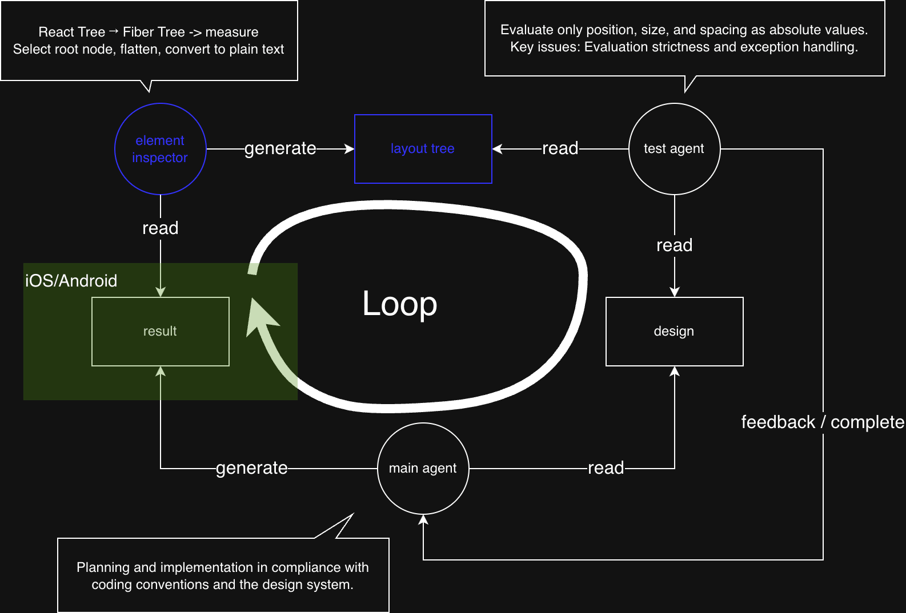

# @react-native-scalable-devtools/element-inspector-plugin

[English](README.md)

`@react-native-scalable-devtools/cli`를 위한 live React Native element tree inspector plugin입니다.

이 plugin은 연결된 React Native 앱의 현재 UI hierarchy(디바이스, 시뮬레이터에 랜더링된 실제 레이아웃 포함)를 개발 호스트에 노출해서 MCP server, script, agent 같은 도구가 앱 결과물을 직접 확인할 수 있게 합니다.

## 사용법

### plugin 등록

```js
const { startCommand } = require('@react-native-scalable-devtools/cli');
const {
  elementInspectorPlugin,
} = require('@react-native-scalable-devtools/element-inspector-plugin');

module.exports = {
  commands: [startCommand(elementInspectorPlugin())],
};
```

### 연결된 앱 찾기

이 plugin은 core package의 `GET /apps`가 제공하는 `appId`를 사용합니다.

```sh
curl -s "http://localhost:8081/apps"
```

반환된 `appId`를 element tree 요청에 사용하세요. 앱이 하나뿐이면 `appId`를 생략할 수 있습니다. 여러 앱이 연결되어 있으면 올바른 runtime으로 요청이 전달되도록 `appId`를 전달해야 합니다.

### 현재 element tree 요청

```sh
curl -s "http://localhost:8081/element-inspector?appId=<appId>"
```

이 endpoint는 항상 앱 runtime에 새 snapshot을 요청합니다. 캐시된 tree를 반환하지 않습니다.

지원하는 query parameter:

- `appId`: `GET /apps`에서 얻은 연결된 앱 ID
- `start`: 응답의 root로 사용할 component 이름
- `compact`: `1`을 전달하면 zero-size node를 제거하고 단순 wrapper pair를 flatten하며, 응답에서 필요한 필드만 남깁니다
- `plain`: `1`을 전달하면 JSON 대신 들여쓰기된 `text/plain` tree를 반환합니다
- `layoutPrecision`: `layout` 값에 남길 소수점 자릿수
- `nodeId`: node id 출력 여부를 제어합니다. `1`을 전달하면 node id를 포함하고, `0`을 전달하면 JSON output에서도 제거합니다. 생략하면 기본 JSON response는 node id를 유지하고, compact/plain output은 node id를 생략합니다.

`compact`는 `1`만 지원합니다. 값이 없거나 비어 있거나 `0`이면 비활성 상태로 처리됩니다.

`compact`와 `plain=1`을 함께 사용하면 tree를 먼저 compact 처리한 뒤 plain text로 렌더링합니다.
`plain=1`이 활성화되면 `displayName`이 node label을 대체합니다.

예시:

```sh
curl -s "http://localhost:8081/element-inspector?appId=<appId>&start=RCTView"
curl -s "http://localhost:8081/element-inspector?appId=<appId>&compact=1"
curl -s "http://localhost:8081/element-inspector?appId=<appId>&plain=1"
curl -s "http://localhost:8081/element-inspector?appId=<appId>&compact=1&plain=1"
curl -s "http://localhost:8081/element-inspector?appId=<appId>&layoutPrecision=2"
```

## Element Inspector Flow

다음과 같이 사용할 수 있습니다. plugin이 React tree를 읽어 layout tree로 정리한 뒤, test agent가 결과물을 평가할 수 있습니다.



element inspector plugin은 root node 선택, wrapper flatten, plain text 변환을 통해 token과 context를 절약할 수 있게 해줍니다.

가상환경이 아닌 개발 호스트 환경에서 live element tree를 직접 확인할 수 있습니다.

Plain output은 depth마다 두 칸을 들여쓰며, text, layout, style prop이 있으면 각 node를 `Type "text" [x,y,width,height] style={...}` 형식으로 렌더링합니다. `testID`, `nativeID`, `accessibilityLabel` 같은 target prop이 있으면 `props={...}` 형식으로 렌더링합니다. `nodeId=1`이 활성화되면 node id를 `id=<id>` 형식으로 렌더링합니다. `style` field는 token을 줄이기 위한 compact 표현이며 identifier 형태의 key에는 따옴표를 붙이지 않습니다. `layout` 값은 JSON response와 같은 소수점 자릿수를 사용하고, 기본값은 소수점 첫째 자리입니다.

```text
RCTView id=root.0 [0,0,390,844]
  RCTText id=root.0.1 "Welcome to React Native" [65,230,271,28] style={fontSize:18}
```

## 출력 노트

Snapshot은 기본 JSON response를 포함한 모든 mode에서 `DebuggingOverlay`와 `LogBoxStateSubscription`이라는 React Native 개발 UI node를 생략합니다.

JSON response는 element node에 `displayName`을 포함합니다. Component가 `displayName`을 정의하지 않으면 이 field는 node `type`으로 fallback됩니다.

Compact JSON과 plain text response는 `nodeId=1`이 전달되었을 때 node id를 유지하므로 다른 도구가 compact tree를 읽은 뒤 특정 node에 action을 수행할 수 있습니다. Wrapper node가 collapse되면 남는 child는 자신의 원래 `id`를 유지합니다.

## 앱 식별자

이 plugin은 snapshot 요청을 받을 연결된 React Native runtime을 선택하기 위해 `appId`를 사용합니다.

core package의 `GET /apps`로 연결된 앱을 찾은 뒤, `/apps`에서 앱 리스트를 확인하고 선택한 `appId`를 `GET /element-inspector`에 전달하세요.

`appId`를 사용하는 이유는 하나의 development server에 여러 앱이 동시에 연결될 수 있기 때문입니다. 여기에는 emulator와 실제 기기가 모두 포함될 수 있습니다. 공개 REST API는 요청을 받을 AppProxy 연결을 안정적으로 선택할 selector가 필요합니다.

`deviceInfo.deviceId`는 여전히 `GET /apps`에서 metadata로 제공되며, 외부 자동화 도구가 필요로 할 수 있습니다. Android 또는 iOS 기기 식별자를 확인할 수 없으면 `"unknown"`으로 설정됩니다.

## 패키지 노트

이 plugin은 debugger frontend를 patch하지 않습니다.

network plugin 없이도 사용할 수 있지만, 두 plugin은 모두 `@react-native-scalable-devtools/cli`의 동일한 core AppProxy 모델을 공유합니다.
